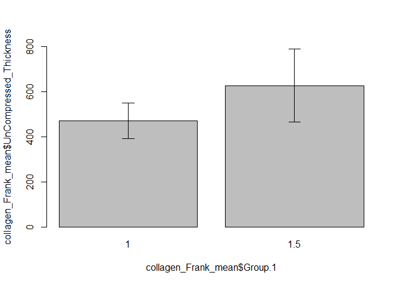
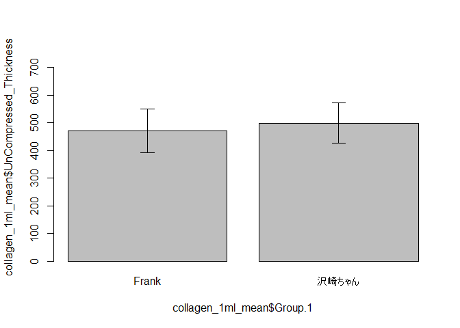
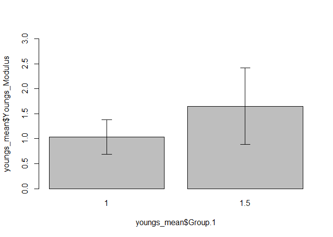

The Thickness of Collagen Membrane
================
Frank (Bo-Jiang Lin)
2022-08-28

## GitHub Documents

This is an R Markdown format used for publishing markdown documents to
GitHub. When you click the **Knit** button all R code chunks are run and
a markdown file (.md) suitable for publishing to GitHub is generated.

## Including Code

### 1. Configure the necessary environment and packages

The analysis is powered by R version 4.2.1 (2022-06-23 ucrt).

``` r
library(readxl)
library(UsingR)
library(lessR)
library(ggplot2)
library(knitr)
```

### 2. Read Data

| Date       | Person     | 60 mm Dish (μm) | Buffer (pH) | Total_solution_quantity | Centrifuge time (min) | Uncompressed Depth (μm) | 7days and Compressed Depth (μm) | 0 days and Compressed Depth (μm) | Compressed Thickness (μm) after 7 days | Compressed Thickness (μm) after 0 days | UnCompressed_Thickness | 7days Compression ratio | 0 days Compression ratio | Youngs_Modulus |
|:-----------|:-----------|----------------:|------------:|------------------------:|----------------------:|------------------------:|--------------------------------:|---------------------------------:|---------------------------------------:|---------------------------------------:|-----------------------:|------------------------:|-------------------------:|---------------:|
| 2020-09-01 | Oyamasan   |        4331.506 |         7.7 |                     1.0 |                     5 |                      NA |                        4133.562 |                         4240.659 |                              197.94400 |                               90.84700 |                     NA |                      NA |                       NA |             NA |
| 2020-09-01 | Oyamasan   |        4331.506 |         7.7 |                     1.0 |                     5 |                      NA |                        4173.562 |                         4238.562 |                              157.94400 |                               92.94400 |                     NA |                      NA |                       NA |             NA |
| 2020-09-01 | Oyamasan   |        4331.506 |         7.7 |                     1.0 |                     5 |                      NA |                        4160.617 |                         4232.534 |                              170.88900 |                               98.97200 |                     NA |                      NA |                       NA |             NA |
| 2020-09-01 | Oyamasan   |        4331.506 |         7.7 |                     1.0 |                     5 |                      NA |                        4141.555 |                         4230.881 |                              189.95100 |                              100.62500 |                     NA |                      NA |                       NA |             NA |
| 2020-09-01 | Oyamasan   |        4331.506 |         7.7 |                     1.0 |                     5 |                      NA |                        4142.180 |                         4202.131 |                              189.32600 |                              129.37500 |                     NA |                      NA |                       NA |             NA |
| 2020-09-01 | Oyamasan   |        4331.506 |         7.7 |                     1.0 |                    10 |                      NA |                        4281.867 |                               NA |                               49.63900 |                                     NA |                     NA |                      NA |                       NA |             NA |
| 2020-09-01 | Oyamasan   |        4331.506 |         7.7 |                     1.0 |                    10 |                      NA |                        4275.083 |                               NA |                               56.42300 |                                     NA |                     NA |                      NA |                       NA |             NA |
| 2020-09-01 | Oyamasan   |        4331.506 |         7.7 |                     1.0 |                    10 |                      NA |                        4220.486 |                               NA |                              111.02000 |                                     NA |                     NA |                      NA |                       NA |             NA |
| 2020-09-01 | Oyamasan   |        4331.506 |         7.7 |                     1.0 |                    10 |                      NA |                        4242.583 |                               NA |                               88.92300 |                                     NA |                     NA |                      NA |                       NA |             NA |
| 2020-09-01 | Oyamasan   |        4331.506 |         7.7 |                     1.0 |                    10 |                      NA |                        4230.263 |                               NA |                              101.24300 |                                     NA |                     NA |                      NA |                       NA |             NA |
| 2021-12-27 | 沢崎ちゃん |              NA |         7.7 |                     1.0 |                    10 |                      NA |                              NA |                               NA |                               54.28102 |                               63.55051 |               539.0081 |               0.8992946 |                0.8820973 |             NA |
| 2021-12-27 | 沢崎ちゃん |              NA |         7.7 |                     1.0 |                    10 |                      NA |                              NA |                               NA |                               61.60513 |                               33.18034 |               529.0017 |               0.8835446 |                0.9372774 |             NA |
| 2021-12-27 | 沢崎ちゃん |              NA |         7.7 |                     1.0 |                    10 |                      NA |                              NA |                               NA |                               72.51781 |                               44.06275 |               331.0787 |               0.7809650 |                0.8669116 |             NA |
| 2021-12-27 | 沢崎ちゃん |              NA |         7.7 |                     1.0 |                    10 |                      NA |                              NA |                               NA |                               77.11117 |                               40.44154 |               529.4668 |               0.8543607 |                0.9236184 |             NA |
| 2021-12-27 | 沢崎ちゃん |              NA |         7.7 |                     1.0 |                    10 |                      NA |                              NA |                               NA |                              116.40996 |                               30.34441 |               425.1299 |               0.7261779 |                0.9286232 |             NA |
| 2021-12-27 | 沢崎ちゃん |              NA |         7.7 |                     1.0 |                    10 |                      NA |                              NA |                               NA |                               96.01708 |                               38.70173 |               447.3281 |               0.7853542 |                0.9134824 |             NA |
| 2021-12-27 | 沢崎ちゃん |              NA |         7.7 |                     1.0 |                    10 |                      NA |                              NA |                               NA |                               95.89938 |                               37.53796 |               480.3000 |               0.8003344 |                0.9218448 |             NA |
| 2021-12-27 | 沢崎ちゃん |              NA |         7.7 |                     1.0 |                    10 |                      NA |                              NA |                               NA |                               90.62462 |                               50.31502 |               462.4761 |               0.8040448 |                0.8912052 |             NA |
| 2021-12-27 | 沢崎ちゃん |              NA |         7.7 |                     1.0 |                    10 |                      NA |                              NA |                               NA |                               69.58321 |                               45.21419 |               433.5981 |               0.8395214 |                0.8957233 |             NA |
| 2021-12-27 | 沢崎ちゃん |              NA |         7.7 |                     1.0 |                    10 |                      NA |                              NA |                               NA |                               92.81083 |                               38.41524 |               479.1434 |               0.8062984 |                0.9198252 |             NA |
| 2021-12-29 | 沢崎ちゃん |              NA |         7.7 |                     1.0 |                    10 |                      NA |                              NA |                               NA |                               58.24353 |                               32.89254 |               527.4088 |               0.8895666 |                0.9376337 |             NA |
| 2021-12-29 | 沢崎ちゃん |              NA |         7.7 |                     1.0 |                    10 |                      NA |                              NA |                               NA |                               45.62203 |                               38.15266 |               604.6962 |               0.9245538 |                0.9369061 |             NA |
| 2021-12-29 | 沢崎ちゃん |              NA |         7.7 |                     1.0 |                    10 |                      NA |                              NA |                               NA |                               52.48127 |                               39.05749 |               551.3613 |               0.9048151 |                0.9291617 |             NA |
| 2021-12-29 | 沢崎ちゃん |              NA |         7.7 |                     1.0 |                    10 |                      NA |                              NA |                               NA |                               38.84945 |                               53.32163 |               547.6929 |               0.9290671 |                0.9026432 |             NA |
| 2021-12-29 | 沢崎ちゃん |              NA |         7.7 |                     1.0 |                    10 |                      NA |                              NA |                               NA |                               39.93269 |                               56.51529 |               605.7818 |               0.9340807 |                0.9067069 |             NA |
| 2022-08-28 | Frank      |        6262.500 |          NA |                      NA |                    NA |                      NA |                              NA |                               NA |                                     NA |                                     NA |                     NA |                      NA |                       NA |             NA |
| 2022-08-28 | Frank      |        6252.632 |          NA |                      NA |                    NA |                      NA |                              NA |                               NA |                                     NA |                                     NA |                     NA |                      NA |                       NA |             NA |
| 2022-08-28 | Frank      |        6248.166 |          NA |                      NA |                    NA |                      NA |                              NA |                               NA |                                     NA |                                     NA |                     NA |                      NA |                       NA |             NA |
| 2022-08-28 | Frank      |        6268.035 |          NA |                      NA |                    NA |                      NA |                              NA |                               NA |                                     NA |                                     NA |                     NA |                      NA |                       NA |             NA |
| 2022-08-28 | Frank      |        6262.632 |          NA |                      NA |                    NA |                      NA |                              NA |                               NA |                                     NA |                                     NA |                     NA |                      NA |                       NA |             NA |
| 2022-08-28 | Frank      |              NA |         7.7 |                     1.5 |                    NA |                5603.528 |                              NA |                               NA |                                0.00000 |                                     NA |               658.9720 |               1.0000000 |                1.0000000 |             NA |
| 2022-08-28 | Frank      |              NA |         7.7 |                     1.5 |                    NA |                5436.340 |                              NA |                               NA |                                0.00000 |                                     NA |               816.2920 |               1.0000000 |                1.0000000 |        1.44500 |
| 2022-08-28 | Frank      |              NA |         7.7 |                     1.5 |                    NA |                5760.444 |                              NA |                               NA |                                0.00000 |                                     NA |               487.7220 |               1.0000000 |                1.0000000 |        2.50300 |
| 2022-08-28 | Frank      |              NA |         7.7 |                     1.5 |                    NA |                5830.972 |                              NA |                               NA |                                0.00000 |                                     NA |               437.0630 |               1.0000000 |                1.0000000 |             NA |
| 2022-08-28 | Frank      |              NA |         7.7 |                     1.5 |                    NA |                5524.819 |                              NA |                               NA |                                0.00000 |                                     NA |               737.8130 |               1.0000000 |                1.0000000 |        1.00800 |
| 2022-08-28 | Frank      |              NA |         7.7 |                     1.0 |                    NA |                5750.938 |                              NA |                               NA |                                0.00000 |                                     NA |               511.5620 |               1.0000000 |                1.0000000 |        1.36900 |
| 2022-08-28 | Frank      |              NA |         7.7 |                     1.0 |                    NA |                5695.666 |                              NA |                               NA |                                0.00000 |                                     NA |               556.9660 |               1.0000000 |                1.0000000 |        0.45606 |
| 2022-08-28 | Frank      |              NA |         7.7 |                     1.0 |                    NA |                5738.035 |                              NA |                               NA |                                0.00000 |                                     NA |               510.1310 |               1.0000000 |                1.0000000 |        1.13400 |
| 2022-08-28 | Frank      |              NA |         7.7 |                     1.0 |                    NA |                5901.875 |                              NA |                               NA |                                0.00000 |                                     NA |               366.1600 |               1.0000000 |                1.0000000 |        1.20600 |
| 2022-08-28 | Frank      |              NA |         7.7 |                     1.0 |                    NA |                5848.660 |                              NA |                               NA |                                0.00000 |                                     NA |               413.9720 |               1.0000000 |                1.0000000 |        0.99950 |

### 3. Exploratory Data Analysis for 2022-08-28 data

#### Descriptive Statistics on the 2022-08-28 data

| Group.1 | Total_solution_quantity | UnCompressed_Thickness |
|--------:|------------------------:|-----------------------:|
|     1.0 |                     1.0 |               471.7582 |
|     1.5 |                     1.5 |               627.5724 |

#### Check whether the 2022-08-28 data is normal distribution

``` r
summary(collagen$UnCompressed_Thickness)
```

    ##    Min. 1st Qu.  Median    Mean 3rd Qu.    Max.    NA's 
    ##   331.1   447.3   511.6   519.6   551.4   816.3      15

``` r
#Creat a table

normal <- shapiro.test(collagen$UnCompressed_Thickness)
normal
```

    ## 
    ##  Shapiro-Wilk normality test
    ## 
    ## data:  collagen$UnCompressed_Thickness
    ## W = 0.94094, p-value = 0.1556

##### The 2022-08-28 data shows p-value = 0.16 \>= 0.1. It represent that the data distrubute normally and ready for further test..

``` r
variance <- var.test(collagen_Frank$UnCompressed_Thickness ~ collagen_Frank$Total_solution_quantity)
variance
```

    ## 
    ##  F test to compare two variances
    ## 
    ## data:  collagen_Frank$UnCompressed_Thickness by collagen_Frank$Total_solution_quantity
    ## F = 0.23715, num df = 4, denom df = 4, p-value = 0.1923
    ## alternative hypothesis: true ratio of variances is not equal to 1
    ## 95 percent confidence interval:
    ##  0.02469157 2.27772349
    ## sample estimates:
    ## ratio of variances 
    ##           0.237151

``` r
comparison <- t.test(collagen_Frank$UnCompressed_Thickness ~ collagen_Frank$Total_solution_quantity, var.equal = TRUE)
comparison
```

    ## 
    ##  Two Sample t-test
    ## 
    ## data:  collagen_Frank$UnCompressed_Thickness by collagen_Frank$Total_solution_quantity
    ## t = -1.937, df = 8, p-value = 0.08875
    ## alternative hypothesis: true difference in means between group 1 and group 1.5 is not equal to 0
    ## 95 percent confidence interval:
    ##  -341.31026   29.68186
    ## sample estimates:
    ##   mean in group 1 mean in group 1.5 
    ##          471.7582          627.5724

##### The 2022-08-28 data shows p-value is 0.09 \>= 0.05 which means we accept the H0 hypothesis.

### 4. Reproducibility

| Group.1    | Total_solution_quantity | UnCompressed_Thickness |
|:-----------|------------------------:|-----------------------:|
| Frank      |                       1 |               471.7582 |
| 沢崎ちゃん |                       1 |               499.5648 |

``` r
var.test(collagen_1ml$UnCompressed_Thickness ~ collagen_1ml$Person)
```

    ## 
    ##  F test to compare two variances
    ## 
    ## data:  collagen_1ml$UnCompressed_Thickness by collagen_1ml$Person
    ## F = 1.1639, num df = 4, denom df = 14, p-value = 0.7364
    ## alternative hypothesis: true ratio of variances is not equal to 1
    ## 95 percent confidence interval:
    ##   0.2990615 10.1072340
    ## sample estimates:
    ## ratio of variances 
    ##           1.163922

``` r
reproducibility <- t.test(collagen_1ml$UnCompressed_Thickness ~ collagen_1ml$Person,var.equal=TRUE)
reproducibility
```

    ## 
    ##  Two Sample t-test
    ## 
    ## data:  collagen_1ml$UnCompressed_Thickness by collagen_1ml$Person
    ## t = -0.72459, df = 18, p-value = 0.478
    ## alternative hypothesis: true difference in means between group Frank and group 沢崎ちゃん is not equal to 0
    ## 95 percent confidence interval:
    ##  -108.43024   52.81707
    ## sample estimates:
    ##      mean in group Frank mean in group 沢崎ちゃん 
    ##                 471.7582                 499.5648

##### The p-value is 0.48 which means the data reach to the consensus results while p-value is higher than 0.05.

### 5. Young’s Modulus fo The 2022-08-28 data

``` r
youngs_mean <- aggregate(collagen_Frank[c("Total_solution_quantity","Youngs_Modulus")],list(collagen_Frank$Total_solution_quantity),mean,na.rm = TRUE)
youngs_sd <- aggregate(collagen_Frank[c("Total_solution_quantity","Youngs_Modulus")],list(collagen_Frank$Total_solution_quantity),sd,na.rm = TRUE)
kable(youngs_mean)
```

| Group.1 | Total_solution_quantity | Youngs_Modulus |
|--------:|------------------------:|---------------:|
|     1.0 |                     1.0 |       1.032912 |
|     1.5 |                     1.5 |       1.652000 |

``` r
normal_youngs <- shapiro.test(collagen_Frank$Youngs_Modulus)
normal_youngs
```

    ## 
    ##  Shapiro-Wilk normality test
    ## 
    ## data:  collagen_Frank$Youngs_Modulus
    ## W = 0.87667, p-value = 0.175

##### The 2022-08-28 data shows p-value = 0.17 \>= 0.1. It represent that the data distrubute normally and ready for further test..

``` r
youngs_var <- var.test(collagen_Frank$Youngs_Modulus ~ collagen_Frank$Total_solution_quantity)
youngs_var
```

    ## 
    ##  F test to compare two variances
    ## 
    ## data:  collagen_Frank$Youngs_Modulus by collagen_Frank$Total_solution_quantity
    ## F = 0.20605, num df = 4, denom df = 2, p-value = 0.1703
    ## alternative hypothesis: true ratio of variances is not equal to 1
    ## 95 percent confidence interval:
    ##  0.005249828 2.194222053
    ## sample estimates:
    ## ratio of variances 
    ##          0.2060474

##### The 2022-08-28 data shows p-value is 0.17 \>= 0.05 which means we accept the H0 hypothesis.

``` r
youngs_compar <- t.test(collagen_Frank$Youngs_Modulus ~ collagen_Frank$Total_solution_quantity, var.equal = TRUE)
youngs_compar
```

    ## 
    ##  Two Sample t-test
    ## 
    ## data:  collagen_Frank$Youngs_Modulus by collagen_Frank$Total_solution_quantity
    ## t = -1.6074, df = 6, p-value = 0.1591
    ## alternative hypothesis: true difference in means between group 1 and group 1.5 is not equal to 0
    ## 95 percent confidence interval:
    ##  -1.5615057  0.3233297
    ## sample estimates:
    ##   mean in group 1 mean in group 1.5 
    ##          1.032912          1.652000

##### The 2022-08-28 data shows p-value is 0.16 \>= 0.05 which means we accept the H0 hypothesis.

## Including Plots

### 1. the distribution of the 2022-08-28 data

<!-- -->

### 2. the comparison of the 2022-08-28 data

<!-- -->

### 3. the comparison study on the 2022-08-28 data with the prvious study

<!-- -->

### 4. the distribution of the 2022-08-28 data for Young’s Modulus

<!-- -->

    ## integer(0)

### 5. the comparison study on the 2022-08-28 data for Young’s Modulus

<!-- -->

Note that the `echo = FALSE` parameter was added to the code chunk to
prevent printing of the R code that generated the plot.
