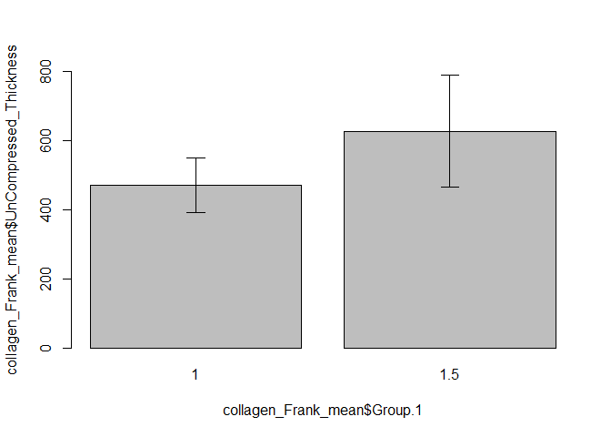
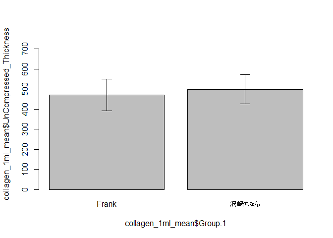
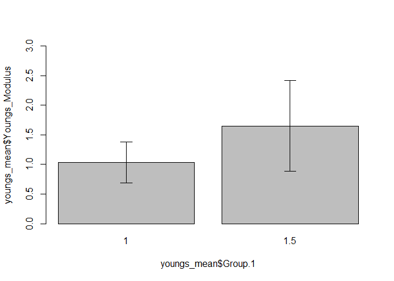

The Thickness of Collagen Membrane
================
Frank (Bo-Jiang Lin)
2022-08-28

## GitHub Documents

This is an R Markdown format used for publishing markdown documents to
GitHub. When you click the **Knit** button all R code chunks are run and
a markdown file (.md) suitable for publishing to GitHub is generated.

## Including Code

### 1. Configure the necessary environment and packages

The analysis is powered by R version 4.2.1 (2022-06-23 ucrt).

``` r
library(readxl)
library(UsingR)
library(lessR)
library(ggplot2)
library(knitr)
```

### 2. Read Data

| Date       | Person | 60 mm Dish (μm) | Buffer (pH) | Total_solution_quantity | Centrifuge time (min) | Uncompressed Depth (μm) | 7days and Compressed Depth (μm) | 0 days and Compressed Depth (μm) | 7 days Compressed Thickness (μm) | zero_day_Compressed_Thickness | UnCompressed_Thickness | 7days Compression ratio | 0 days Compression ratio | Youngs_Modulus |
|:-----------|:-------|----------------:|------------:|------------------------:|----------------------:|------------------------:|--------------------------------:|---------------------------------:|---------------------------------:|------------------------------:|-----------------------:|------------------------:|-------------------------:|---------------:|
| 2022-08-28 | Frank  |        6262.500 |          NA |                      NA |                    NA |                      NA |                              NA |                               NA |                               NA |                            NA |                     NA |                      NA |                       NA |             NA |
| 2022-08-28 | Frank  |        6252.632 |          NA |                      NA |                    NA |                      NA |                              NA |                               NA |                               NA |                            NA |                     NA |                      NA |                       NA |             NA |
| 2022-08-28 | Frank  |        6248.166 |          NA |                      NA |                    NA |                      NA |                              NA |                               NA |                               NA |                            NA |                     NA |                      NA |                       NA |             NA |
| 2022-08-28 | Frank  |        6268.035 |          NA |                      NA |                    NA |                      NA |                              NA |                               NA |                               NA |                            NA |                     NA |                      NA |                       NA |             NA |
| 2022-08-28 | Frank  |        6262.632 |          NA |                      NA |                    NA |                      NA |                              NA |                               NA |                               NA |                            NA |                     NA |                      NA |                       NA |             NA |
| 2022-08-28 | Frank  |              NA |         7.7 |                     1.5 |                    NA |                5603.528 |                              NA |                         5863.174 |                                0 |                       454.416 |                658.972 |                       1 |                0.3104168 |             NA |
| 2022-08-28 | Frank  |              NA |         7.7 |                     1.5 |                    NA |                5436.340 |                              NA |                         5888.577 |                                0 |                       429.013 |                816.292 |                       1 |                0.4744368 |        1.44500 |
| 2022-08-28 | Frank  |              NA |         7.7 |                     1.5 |                    NA |                5760.444 |                              NA |                         5918.799 |                                0 |                       398.791 |                487.722 |                       1 |                0.1823395 |        2.50300 |
| 2022-08-28 | Frank  |              NA |         7.7 |                     1.5 |                    NA |                5830.972 |                              NA |                         5962.105 |                                0 |                       355.485 |                437.063 |                       1 |                0.1866504 |             NA |
| 2022-08-28 | Frank  |              NA |         7.7 |                     1.5 |                    NA |                5524.819 |                              NA |                         5914.341 |                                0 |                       403.249 |                737.813 |                       1 |                0.4534537 |        1.00800 |
| 2022-08-28 | Frank  |              NA |         7.7 |                     1.0 |                    NA |                5750.938 |                              NA |                         6169.938 |                                0 |                       147.652 |                511.562 |                       1 |                0.7113703 |        1.36900 |
| 2022-08-28 | Frank  |              NA |         7.7 |                     1.0 |                    NA |                5695.666 |                              NA |                         6173.716 |                                0 |                       143.874 |                556.966 |                       1 |                0.7416826 |        0.45606 |
| 2022-08-28 | Frank  |              NA |         7.7 |                     1.0 |                    NA |                5738.035 |                              NA |                         6160.550 |                                0 |                       157.040 |                510.131 |                       1 |                0.6921575 |        1.13400 |
| 2022-08-28 | Frank  |              NA |         7.7 |                     1.0 |                    NA |                5901.875 |                              NA |                         6150.287 |                                0 |                       167.303 |                366.160 |                       1 |                0.5430877 |        1.20600 |
| 2022-08-28 | Frank  |              NA |         7.7 |                     1.0 |                    NA |                5848.660 |                              NA |                         6151.849 |                                0 |                       165.741 |                413.972 |                       1 |                0.5996323 |        0.99950 |

### 3. Exploratory Data Analysis of the uncompressed thickness for 2022-08-28 data

#### Descriptive Statistics on the 2022-08-28 data

| Group.1 | Total_solution_quantity | UnCompressed_Thickness | zero_day_Compressed_Thickness |
|--------:|------------------------:|-----------------------:|------------------------------:|
|     1.0 |                     1.0 |               471.7582 |                      156.3220 |
|     1.5 |                     1.5 |               627.5724 |                      408.1908 |

#### Check whether the 2022-08-28 data is normal distribution

``` r
summary(collagen$UnCompressed_Thickness)
```

    ##    Min. 1st Qu.  Median    Mean 3rd Qu.    Max.    NA's 
    ##   331.1   447.3   511.6   519.6   551.4   816.3      16

``` r
#Creat a table

normal <- shapiro.test(collagen$UnCompressed_Thickness)
normal
```

    ## 
    ##  Shapiro-Wilk normality test
    ## 
    ## data:  collagen$UnCompressed_Thickness
    ## W = 0.94094, p-value = 0.1556

##### The 2022-08-28 data shows p-value = 0.16 \>= 0.1. It represent that the data distrubute normally and ready for further test..

``` r
variance <- var.test(collagen_Frank$UnCompressed_Thickness ~ collagen_Frank$Total_solution_quantity)
variance
```

    ## 
    ##  F test to compare two variances
    ## 
    ## data:  collagen_Frank$UnCompressed_Thickness by collagen_Frank$Total_solution_quantity
    ## F = 0.23715, num df = 4, denom df = 4, p-value = 0.1923
    ## alternative hypothesis: true ratio of variances is not equal to 1
    ## 95 percent confidence interval:
    ##  0.02469157 2.27772349
    ## sample estimates:
    ## ratio of variances 
    ##           0.237151

``` r
comparison <- t.test(collagen_Frank$UnCompressed_Thickness ~ collagen_Frank$Total_solution_quantity, var.equal = TRUE)
comparison
```

    ## 
    ##  Two Sample t-test
    ## 
    ## data:  collagen_Frank$UnCompressed_Thickness by collagen_Frank$Total_solution_quantity
    ## t = -1.937, df = 8, p-value = 0.08875
    ## alternative hypothesis: true difference in means between group 1 and group 1.5 is not equal to 0
    ## 95 percent confidence interval:
    ##  -341.31026   29.68186
    ## sample estimates:
    ##   mean in group 1 mean in group 1.5 
    ##          471.7582          627.5724

##### The 2022-08-28 data shows p-value is 0.09 \>= 0.05 which means we accept the H0 hypothesis.

### 4. Reproducibility of uncompressed thickness

| Group.1    | Total_solution_quantity | UnCompressed_Thickness | zero_day_Compressed_Thickness |
|:-----------|------------------------:|-----------------------:|------------------------------:|
| Frank      |                       1 |               471.7582 |                     156.32200 |
| 沢崎ちゃん |                       1 |               499.5648 |                      42.78022 |

``` r
var.test(collagen_1ml$UnCompressed_Thickness ~ collagen_1ml$Person)
```

    ## 
    ##  F test to compare two variances
    ## 
    ## data:  collagen_1ml$UnCompressed_Thickness by collagen_1ml$Person
    ## F = 1.1639, num df = 4, denom df = 14, p-value = 0.7364
    ## alternative hypothesis: true ratio of variances is not equal to 1
    ## 95 percent confidence interval:
    ##   0.2990615 10.1072340
    ## sample estimates:
    ## ratio of variances 
    ##           1.163922

``` r
reproducibility <- t.test(collagen_1ml$UnCompressed_Thickness ~ collagen_1ml$Person,var.equal=TRUE)
reproducibility
```

    ## 
    ##  Two Sample t-test
    ## 
    ## data:  collagen_1ml$UnCompressed_Thickness by collagen_1ml$Person
    ## t = -0.72459, df = 18, p-value = 0.478
    ## alternative hypothesis: true difference in means between group Frank and group 沢崎ちゃん is not equal to 0
    ## 95 percent confidence interval:
    ##  -108.43024   52.81707
    ## sample estimates:
    ##      mean in group Frank mean in group 沢崎ちゃん 
    ##                 471.7582                 499.5648

##### The p-value is 0.48 which means the data reach to the consensus results while p-value is higher than 0.05.

### 5. Young’s Modulus of uncompressed thickness fo The 2022-08-28 data

``` r
youngs_mean <- aggregate(collagen_Frank[c("Total_solution_quantity","Youngs_Modulus")],list(collagen_Frank$Total_solution_quantity),mean,na.rm = TRUE)
youngs_sd <- aggregate(collagen_Frank[c("Total_solution_quantity","Youngs_Modulus")],list(collagen_Frank$Total_solution_quantity),sd,na.rm = TRUE)
kable(youngs_mean)
```

| Group.1 | Total_solution_quantity | Youngs_Modulus |
|--------:|------------------------:|---------------:|
|     1.0 |                     1.0 |       1.032912 |
|     1.5 |                     1.5 |       1.652000 |

``` r
normal_youngs <- shapiro.test(collagen_Frank$Youngs_Modulus)
normal_youngs
```

    ## 
    ##  Shapiro-Wilk normality test
    ## 
    ## data:  collagen_Frank$Youngs_Modulus
    ## W = 0.87667, p-value = 0.175

##### The 2022-08-28 data shows p-value = 0.17 \>= 0.1. It represent that the data distrubute normally and ready for further test..

``` r
youngs_var <- var.test(collagen_Frank$Youngs_Modulus ~ collagen_Frank$Total_solution_quantity)
youngs_var
```

    ## 
    ##  F test to compare two variances
    ## 
    ## data:  collagen_Frank$Youngs_Modulus by collagen_Frank$Total_solution_quantity
    ## F = 0.20605, num df = 4, denom df = 2, p-value = 0.1703
    ## alternative hypothesis: true ratio of variances is not equal to 1
    ## 95 percent confidence interval:
    ##  0.005249828 2.194222053
    ## sample estimates:
    ## ratio of variances 
    ##          0.2060474

##### The 2022-08-28 data shows p-value is 0.17 \>= 0.05 which means we accept the H0 hypothesis.

``` r
youngs_compar <- t.test(collagen_Frank$Youngs_Modulus ~ collagen_Frank$Total_solution_quantity, var.equal = TRUE)
youngs_compar
```

    ## 
    ##  Two Sample t-test
    ## 
    ## data:  collagen_Frank$Youngs_Modulus by collagen_Frank$Total_solution_quantity
    ## t = -1.6074, df = 6, p-value = 0.1591
    ## alternative hypothesis: true difference in means between group 1 and group 1.5 is not equal to 0
    ## 95 percent confidence interval:
    ##  -1.5615057  0.3233297
    ## sample estimates:
    ##   mean in group 1 mean in group 1.5 
    ##          1.032912          1.652000

##### The 2022-08-28 data shows p-value is 0.16 \>= 0.05 which means we accept the H0 hypothesis.

### 6. Exploratory Data Analysis on the compressed thickness for the 2022-08-28 data

``` r
summary(collagen_Frank_1ml$zero_day_Compressed_Thickness)
```

    ##    Min. 1st Qu.  Median    Mean 3rd Qu.    Max. 
    ##   143.9   147.7   157.0   156.3   165.7   167.3

``` r
normalcompressed <- shapiro.test(collagen_Frank_1ml$zero_day_Compressed_Thickness)
normalcompressed
```

    ## 
    ##  Shapiro-Wilk normality test
    ## 
    ## data:  collagen_Frank_1ml$zero_day_Compressed_Thickness
    ## W = 0.90357, p-value = 0.43

``` r
summary(collagen_Frank_1.5ml$zero_day_Compressed_Thickness)
```

    ##    Min. 1st Qu.  Median    Mean 3rd Qu.    Max. 
    ##   355.5   398.8   403.2   408.2   429.0   454.4

``` r
normalcompressed <- shapiro.test(collagen_Frank_1.5ml$zero_day_Compressed_Thickness)
normalcompressed
```

    ## 
    ##  Shapiro-Wilk normality test
    ## 
    ## data:  collagen_Frank_1.5ml$zero_day_Compressed_Thickness
    ## W = 0.97711, p-value = 0.9186

### 7. Comprison study on the compressed thickness for the 2022-08-28 data

``` r
compressed_var <- var.test(collagen_Frank$zero_day_Compressed_Thickness ~ collagen_Frank$Total_solution_quantity)
compressed_var
```

    ## 
    ##  F test to compare two variances
    ## 
    ## data:  collagen_Frank$zero_day_Compressed_Thickness by collagen_Frank$Total_solution_quantity
    ## F = 0.08056, num df = 4, denom df = 4, p-value = 0.03169
    ## alternative hypothesis: true ratio of variances is not equal to 1
    ## 95 percent confidence interval:
    ##  0.008387669 0.773737260
    ## sample estimates:
    ## ratio of variances 
    ##         0.08055962

``` r
compressed_t <- t.test(collagen_Frank$zero_day_Compressed_Thickness ~ collagen_Frank$Total_solution_quantity, var.equal = FALSE)
compressed_t
```

    ## 
    ##  Welch Two Sample t-test
    ## 
    ## data:  collagen_Frank$zero_day_Compressed_Thickness by collagen_Frank$Total_solution_quantity
    ## t = -14.663, df = 4.6403, p-value = 0.00004592
    ## alternative hypothesis: true difference in means between group 1 and group 1.5 is not equal to 0
    ## 95 percent confidence interval:
    ##  -297.0731 -206.6645
    ## sample estimates:
    ##   mean in group 1 mean in group 1.5 
    ##          156.3220          408.1908

##### The 2022-08-28 data shows p-value is 0 \< 0.5 which means we reject the H0 hypothesis and accept the H1 hypothesis.

### 8. Reproducibility on the compressed thickness

``` r
var.test(collagen_1ml$zero_day_Compressed_Thickness ~ collagen_1ml$Person)
```

    ## 
    ##  F test to compare two variances
    ## 
    ## data:  collagen_1ml$zero_day_Compressed_Thickness by collagen_1ml$Person
    ## F = 1.2378, num df = 4, denom df = 14, p-value = 0.6794
    ## alternative hypothesis: true ratio of variances is not equal to 1
    ## 95 percent confidence interval:
    ##   0.3180337 10.7484269
    ## sample estimates:
    ## ratio of variances 
    ##            1.23776

``` r
reproducibility_compressed <- t.test(collagen_1ml$zero_day_Compressed_Thickness ~ collagen_1ml$Person, var.equal = TRUE)
reproducibility_compressed
```

    ## 
    ##  Two Sample t-test
    ## 
    ## data:  collagen_1ml$zero_day_Compressed_Thickness by collagen_1ml$Person
    ## t = 22.732, df = 18, p-value = 0.00000000000001045
    ## alternative hypothesis: true difference in means between group Frank and group 沢崎ちゃん is not equal to 0
    ## 95 percent confidence interval:
    ##  103.0483 124.0353
    ## sample estimates:
    ##      mean in group Frank mean in group 沢崎ちゃん 
    ##                156.32200                 42.78022

##### The 2022-08-28 data shows p-value is 0 \< 0.5 which means we reject the H0 hypothesis and accept the H1 hypothesis.

## Including Plots

### 1. the distribution of the 2022-08-28 data

<!-- -->

### 2. the comparison of the 2022-08-28 data

<!-- -->

### 3. the comparison study on the 2022-08-28 data with the prvious study

<!-- -->

### 4. the distribution of the 2022-08-28 data for Young’s Modulus

<!-- -->

    ## integer(0)

### 5. the comparison study on the 2022-08-28 data for Young’s Modulus

<!-- -->

### 6. THe distribution of 1 ml collagen membrane in the 2022-08-28 data after compressed

<!-- -->

### 7. The distribution of 1.5 ml collagen membrane in the 2022-08-28 data after compressed

<!-- -->

### 8. The comparison of the compressed membrane bewteen different ammount

<!-- -->

### 9. The reproducibility of the compressed membrane

<!-- -->

Note that the `echo = FALSE` parameter was added to the code chunk to
prevent printing of the R code that generated the plot.
